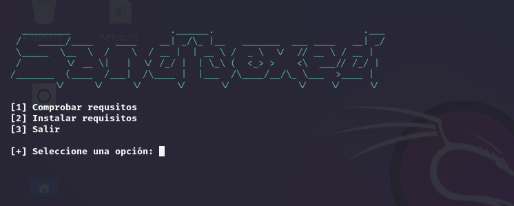
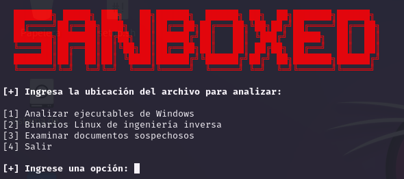

# Sandboxed

<p align="center">

</p>

Un sandbox es un entorno de pruebas aislado en el que se pueden ejecutar aplicaciones o programas sin afectar el sistema operativo subyacente. Se utiliza con frecuencia para probar software nuevo, realizar pruebas de seguridad y aislar aplicaciones que pueden ser sospechosas o potencialmente maliciosas.

Este repositorio te servirá para analizar malware en un entorno aislado ya que tiene herramientas útiles y facil de usar.

```
git clone https://github.com/bl4ck44/Sandboxed.git

cd Sandboxed

chmod +x setup.sh

sudo bash setup.sh

python3 sandbox.py
```

<p align="center">

</p>

<p align="center">

</p>

<br>

# Contenido de herramientas

## Analizar ejecutables de Windows
* **Propiedades estáticas:** manalyze, peframe.

* **Strings y Deofuscación:** pestr, flarestrings, floss.

## Binarios Linux de ingeniería inversa

* **Propiedades estáticas:** trid, exiftool.

* **Desmontar/Descompilar:** cutter.

## Examinar documentos sospechosos

* **Archivos de Microsoft Office:** pcodedmp, olevba, xlmdeobfuscator.

* **Archivos RTF:** rtfobj.

* **Archivos PDF:** pdfextract, pdfdecrypt,pdfresurrect.